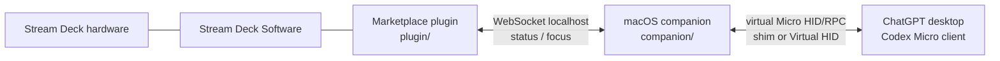
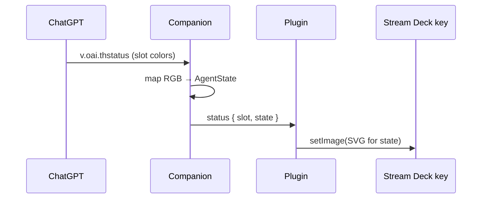
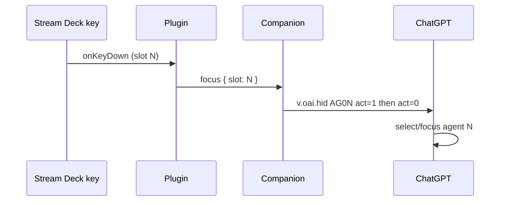

# feat: Stream Deck Codex Agent Buttons (plugin + companion)

## Summary

Build a monorepo with (1) an Elgato Stream Deck Marketplace plugin that renders up to six live agent-status keys and (2) a GitHub-released macOS companion that presents a virtual Codex Micro to ChatGPT desktop and bridges status/focus over localhost IPC. MVP is agent slots only.

---

## Problem Frame

Codex Micro gives live agent RGB status and one-tap focus, but hardware is scarce and expensive. ChatGPT only pushes agent status over the Micro HID/RPC path, so a Marketplace plugin alone cannot light keys. Operators with Stream Decks need a plugin surface plus a companion that emulates Micro presence. (see origin: `docs/brainstorms/2026-07-22-streamdeck-codex-agent-buttons-requirements.md`)

---

## Requirements

Traced from origin R/S/AE IDs:

| ID | Requirement | Plan coverage |
|----|-------------|----------------|
| R1 | Marketplace-shaped Stream Deck plugin | U1, U4, U6 |
| R2 | macOS companion required for status | U3, U5, U6 |
| R3 | ChatGPT desktop Codex only | U3, Scope |
| R4 | Up to six agent slots | U4, U5 |
| R5 | Live state visuals (idle / working / complete / needs input / error) | U2, U4, U5 |
| R6 | Unassigned/off distinct from idle | U4, U5 |
| R7 | Press focuses agent | U3, U4, U5 |
| R8 | Adaptive multi-model layouts | U6 |
| R9 | First-run docs | U6 |
| R10 | Clear offline/disconnected indication | U4, U5 |
| R11 | Personal Mac reliability first | U6, Success |
| R12 | Hooks for future command keys (not MVP) | KTD: protocol/key map extensibility |
| S1–S4 | E2E status, focus, cold-start, pack validation | U6 + Verification |
| AE1–AE4 | Thinking state, focus, companion down, small decks | Unit test scenarios + manual E2E |

---

## Key Technical Decisions

1. **Monorepo with two packages** — `plugin/` (Elgato SDK) and `companion/` (Node bridge + ChatGPT detection). Shared protocol types live in `packages/protocol/` so framing/RPC is tested once and consumed by both sides where needed.

2. **Plugin never spoofs HID or injects into ChatGPT** — Marketplace package stays a normal Stream Deck plugin (UI, settings, `setImage`, key events). All Micro protocol and ChatGPT detection stay in the companion. Reduces Marketplace review risk and keeps injection out of the DRM-packaged plugin.

3. **Companion distribution: separate GitHub release** — Signed/notarized macOS companion (or zip + launch script for early personal builds) linked from plugin docs/PI. Not bundled inside `.streamDeckPlugin`. (see origin D5)

4. **Localhost WebSocket IPC** — Companion hosts `ws://127.0.0.1:<port>` with a small versioned JSON message schema (`status`, `focus`, `hello`, `error`). Plugin is the client. Prefer fixed local port with optional override in settings; reject non-localhost binds.

5. **One plugin action UUID: Agent Slot** — Setting `slot` ∈ `0..5` (or 1–6 display). Six instances on the canvas map to Micro keys `AG00`–`AG05`. Avoids six near-duplicate action UUIDs while remaining profile-friendly.

6. **Live visuals via `setImage` SVG data URLs** — Dynamic solid/color keys (and optional short labels) rendered as SVG; throttle updates to stay under Stream Deck’s ~10 layout updates/sec guideline. `UserTitleEnabled: false` so runtime owns the face. Offline uses distinct muted palette + optional `showAlert` on failed press.

7. **ChatGPT detection: shim-primary for personal v1, HID stretch goal** — Spike both during U3; default path is Electron `NODE_OPTIONS` preload shim into ChatGPT’s `node-hid` (works without Apple Virtual HID entitlement). Virtual HID helper remains an alternate backend behind the same protocol core. Detection choice is an execution spike, not a product fork.

8. **Protocol core reimplementation with public interoperability notes** — Implement framing + JSON-RPC against documented Micro wire behavior (asymmetric newline vs brace-complete JSON, required replies, `v.oai.thstatus`, `v.oai.hid`). May study MIT prior art for correctness; do not ship proprietary icons or OpenAI/Work Louder assets. Prefer Lucide or original SVGs.

9. **macOS-only OS declaration for MVP** — Plugin manifest `OS: [{ Platform: "mac", ... }]`. Windows deferred.

10. **Tooling versions** — Dev Node ≥ 24 for Elgato CLI; plugin runtime Node 20 or 24 per Stream Deck 7.1+; TypeScript throughout; Vitest (or node:test) for protocol unit tests.

---

## High-Level Technical Design

### Component architecture



### Status path (ChatGPT → deck)



### Focus path (deck → ChatGPT)



### Protocol framing note (load-bearing)

Device→host messages are newline-delimited JSON; host→device requests are bare JSON objects completed by balanced braces. Missing replies on `id` requests wedge ChatGPT’s 10s RPC queue. Encoder ticks use `act: 2` (out of MVP but encode in types).

### Multi-device layout

Logical slots `0..5` always. Physical placement via bundled profiles per `DeviceType` (Mini 6 keys 1:1; Plus/Neo 8-key subset+pages; XL freer). Models with fewer than six keys use subset or multi-page profiles (origin AE4).

---

## Output Structure

```text
.
├── package.json                 # workspace root
├── README.md
├── docs/
│   ├── brainstorms/...
│   └── plans/...
├── packages/
│   └── protocol/                # framing, RPC types, state map, tests
│       ├── package.json
│       ├── src/
│       └── test/
├── companion/
│   ├── package.json
│   ├── src/                     # bridge, transports, IPC server, shim launch
│   ├── shim/                    # ChatGPT node-hid preload (if shim path)
│   └── scripts/                 # launch-chatgpt, start companion
└── plugin/
    ├── package.json
    ├── com.<org>.agentbuttons.sdPlugin/
    │   ├── manifest.json
    │   ├── imgs/
    │   ├── ui/                  # property inspector (slot + connection)
    │   └── bin/
    ├── src/
    │   ├── plugin.ts
    │   ├── actions/agent-slot.ts
    │   ├── ipc-client.ts
    │   └── render/state-image.ts
    └── profiles/                # per-device profile sources if used
```

Implementer may adjust names; unit `Files` lists are authoritative per unit.

---

## Implementation Units

### U1. Monorepo and package scaffolding

- **Goal:** Create installable workspace skeleton for protocol, companion, and Stream Deck plugin with shared tooling.
- **Requirements:** R1 (structure for Marketplace plugin), R11
- **Dependencies:** none
- **Files:**
  - create: `package.json`, `README.md`, `.gitignore`
  - create: `packages/protocol/package.json`, `packages/protocol/src/index.ts`
  - create: `companion/package.json`, `companion/src/index.ts`
  - create: `plugin/` via `streamdeck create` (or equivalent manual scaffold) then rename into repo
  - create: `plugin/src/plugin.ts` (stub connect)
- **Approach:** npm/pnpm workspaces. Plugin UUID reverse-DNS owned by author (e.g. `com.<author>.codex-agent-buttons`) — pin once; immutable after Marketplace publish. Document Node 24 for CLI. Companion entrypoint runnable with `node` for early iteration.
- **Test scenarios:** none — scaffolding only (`Test expectation: none -- no behavior yet`)
- **Verification:** `npm install` succeeds; plugin package builds; companion package starts and exits cleanly with `--help` or version flag.

### U2. Codex Micro protocol core (framing + state machine)

- **Goal:** Transport-agnostic Micro protocol: HID report reassembly, JSON extract, request handlers, status lighting events, key notification builders.
- **Requirements:** R5 (status payload path), R7 (hid notifications), R12 (extensible keycodes)
- **Dependencies:** U1
- **Files:**
  - create: `packages/protocol/src/framing.ts`
  - create: `packages/protocol/src/emulator.ts`
  - create: `packages/protocol/src/states.ts`
  - create: `packages/protocol/src/keys.ts`
  - create: `packages/protocol/test/framing.test.ts`
  - create: `packages/protocol/test/emulator.test.ts`
- **Approach:** Implement 64-byte report ID `0x06`, channel 2 RPC, multi-report reassembly. Parse host→device by balanced braces; append `\n` on device→host. Handle `device.status`, `sys.version`, `v.oai.thstatus`, `v.oai.rgbcfg`, `lights.preview` with required id replies. Emit structured events for per-slot colors. Map packed RGB / status strings to enum: `off | idle | working | complete | awaiting | error`. Build `v.oai.hid` payloads for `AG00`–`AG05` press/release. Study public protocol notes / MIT prior art for correctness; keep code original in this repo.
- **Execution note:** Protocol tests first — framing bugs present as silent 10s timeouts in the real app.
- **Test scenarios:**
  - Happy path: single-report RPC request round-trip returns matching `id`.
  - Happy path: multi-report host message reassembled into one JSON object.
  - Happy path: `v.oai.thstatus` updates produce slot color events mapped to working/complete/etc.
  - Edge: back-to-back bare JSON objects without newlines parse as two messages.
  - Edge: incomplete JSON does not emit until braces balance.
  - Edge: device→host messages include trailing newline.
  - Error: unknown method still replies (does not wedge queue).
  - Focus builder: slot 2 produces `AG02` with act 1 then 0.
- **Verification:** Protocol package tests green; no dependency on Stream Deck or ChatGPT.

### U3. Companion: detection backends + bridge loop

- **Goal:** Long-running companion that appears as a Codex Micro to ChatGPT (shim default after spike) and drives the protocol emulator.
- **Requirements:** R2, R3, R7, R10 (link health)
- **Dependencies:** U2
- **Files:**
  - create: `companion/src/bridge.ts`
  - create: `companion/src/transports/*`
  - create: `companion/src/detection/shim.ts` (and optional `virtual-hid.ts` stub)
  - create: `companion/shim/*` (preload/patch if shim path)
  - create: `companion/scripts/launch-chatgpt.sh`
  - create: `companion/test/bridge.integration.test.ts` (loopback, no hardware)
- **Approach:** Spike shim vs Virtual HID early; document winner in companion README. Bridge binds emulator to transport; on lighting events update in-memory slot table. CLI flags: `--verbose`, IPC port, detection mode. Launch script quits/relaunches ChatGPT with shim env when using shim path. Health state: `connected | waiting-for-chatgpt | error`.
- **Test scenarios:**
  - Happy path: loopback fake host handshake + `thstatus` updates slot table.
  - Happy path: focus request emits correct hid notifications on transport.
  - Error: transport disconnect sets health to disconnected/waiting.
  - Edge: duplicate status for same slot is idempotent (no thrash).
- **Verification:** Companion selftest with loopback host passes; manual note for real ChatGPT detection spike results recorded in companion README.

### U4. Companion ↔ plugin IPC + plugin agent-slot action

- **Goal:** Versioned localhost WebSocket API; Stream Deck action that paints state and sends focus.
- **Requirements:** R1, R4, R5, R6, R7, R10
- **Dependencies:** U3 (companion server), U1 (plugin scaffold)
- **Files:**
  - create: `packages/protocol/src/ipc.ts` (shared message types)
  - create: `companion/src/ipc-server.ts`
  - create: `plugin/src/ipc-client.ts`
  - create: `plugin/src/actions/agent-slot.ts`
  - create: `plugin/src/render/state-image.ts`
  - create: `plugin/.../ui/agent-slot.html` (slot + connection status)
  - modify: `plugin/.../manifest.json` (action metadata, macOS OS, optional ApplicationsToMonitor)
  - create: `plugin/src/render/state-image.test.ts` (or protocol-side pure render tests)
  - create: `packages/protocol/test/ipc-schema.test.ts`
- **Approach:** Messages: `hello` (versions), `status` `{slot, state, color?}`, `health` `{companion, chatgpt}`, `focus` `{slot}`, `error`. Plugin reconnects with backoff; on wake re-subscribe. Agent Slot action: settings `{ slot }`; `onWillAppear` register instance; on status match slot → `setImage`; `onKeyDown` → focus IPC; if companion down → offline image + `showAlert`. Off/unassigned vs idle: different SVG. Register `ApplicationsToMonitor` for companion bundle id when available.
- **Test scenarios:**
  - Covers AE1-class: given status working for slot 0, renderer produces non-idle image payload.
  - Covers AE3-class: health disconnected maps to offline visual distinct from idle.
  - Happy path: focus message for slot 3 serializes/deserializes with schema version.
  - Edge: status for unmapped slot ignored by a slot-0 action instance.
  - Error: IPC send failure triggers showAlert path (unit-level mock).
  - Edge: R6 off vs idle image bytes/strings differ.
- **Verification:** With companion loopback mock, plugin watch mode updates a key image; press logs/sends focus.

### U5. End-to-end focus + status integration (companion glue)

- **Goal:** Wire IPC focus into Micro hid notifications and status fan-out to all plugin clients.
- **Requirements:** R5, R7, AE1, AE2
- **Dependencies:** U3, U4
- **Files:**
  - modify: `companion/src/bridge.ts`, `companion/src/ipc-server.ts`
  - create: `companion/test/e2e-loopback.test.ts`
- **Approach:** Single source of truth for slot states in companion. On `v.oai.thstatus`, broadcast IPC status. On IPC `focus`, emit Micro key press/release for that AG slot. Multiple plugin clients optional (single is enough). Debounce identical color updates.
- **Test scenarios:**
  - Integration: fake host thstatus → IPC broadcast → expected state enum.
  - Integration: IPC focus → transport sees AG press/release pair.
  - Covers AE2-class: focus slot index maps 0→AG00 … 5→AG05.
- **Verification:** Automated loopback E2E green; manual ChatGPT pass listed in U6.

### U6. Multi-device profiles, docs, packaging, personal cold-start

- **Goal:** Adaptive layouts, first-run documentation, plugin pack validation, companion release shape.
- **Requirements:** R8, R9, R11, S3, S4, AE4
- **Dependencies:** U4, U5
- **Files:**
  - create/modify: plugin profiles per DeviceType (Mini, MK.2, Plus, XL, Neo as feasible)
  - create: `README.md` (root): architecture, install order, recovery
  - create: `companion/README.md`: detection modes, launch scripts, troubleshooting
  - create: `plugin/README.md`: PI settings, profiles
  - modify: plugin manifest icons/category per Elgato guidelines
  - create: `.github/workflows/ci.yml` (protocol tests + build)
- **Approach:** Document cold-start: start companion → launch ChatGPT (with shim script if needed) → open Stream Deck profile → assign agent keys in ChatGPT Micro settings → verify one slot. `streamdeck validate` + `streamdeck pack`. Companion GitHub release artifacts checklist (binary or node+scripts for personal v0). Offline recovery steps. Legal: unaffiliated disclaimer; no trademarked Micro iconography.
- **Test scenarios:**
  - Packaging: `streamdeck validate` succeeds on plugin package.
  - Docs: cold-start checklist exists and matches actual flags/paths.
  - AE4: Mini profile documents 6-slot 1:1 or explicit subset behavior.
- **Verification:** Author cold-start under a few minutes (S3); at least one real agent run lights a key (S1); press focuses (S2); pack validates (S4).

---

## Phased Delivery

| Phase | Units | Outcome |
|-------|-------|---------|
| 0 Scaffold | U1 | Repo builds |
| 1 Protocol | U2 | Correct Micro framing without hardware |
| 2 Companion spine | U3 | ChatGPT can detect device (spike) |
| 3 Deck UI | U4 | Keys paint from IPC mock |
| 4 Glue | U5 | Status + focus through companion |
| 5 Ship shape | U6 | Profiles, docs, pack, personal daily use |

Command keys, dials, Windows, Marketplace submission polish are **after** S1–S3 are green on the author’s Mac.

---

## Scope Boundaries

### In scope
- Marketplace-shaped plugin + separate macOS companion
- ChatGPT desktop Codex Micro protocol for status + agent key focus
- Six agent slots, live states, offline UX, multi-model layouts
- Shim-primary detection spike; protocol unit tests

### Deferred to Follow-Up Work
- Approve / reject / PTT / branch / submit action keys
- Reasoning dial / encoder `act:2` UX on Stream Deck+
- Virtual HID entitlement path as default
- Windows companion
- Marketplace Maker Console submission and marketing assets
- Multi-agent backends (CLI, Claude, etc.)

### Outside this product’s identity
- Selling Codex Micro hardware
- Hotkey-only profile pack without live status path
- Bundling process injection inside the Marketplace DRM package

---

## Risk Analysis & Mitigation

| Risk | Impact | Mitigation |
|------|--------|------------|
| ChatGPT update breaks shim fuses / paths | Total status loss | Isolate detection; verbose logs; version pin notes; re-spike after updates; design for Virtual HID later |
| Framing/reply bugs wedge ChatGPT RPC | Device “TIMEOUT” | U2 tests for newline/brace asymmetry; always reply to ids |
| Marketplace rejects companion dependency | Distribution delay | Clear PI/docs disclosure; companion not required for plugin to install (degraded offline UI) |
| Stream Deck exclusive HID conflict if using `@elgato-stream-deck/node` in companion | Deck stolen from official app | Plugin uses official Stream Deck Software path only; companion must not open Stream Deck HID when plugin mode is primary |
| Protocol legal/trademark issues | Takedown / review fail | Interoperability reimplementation; no proprietary assets; unaffiliated branding |
| Update rate limits on setImage | Janky lights | Debounce; SVG small; coalesce per slot |

---

## Dependencies / Prerequisites

- Stream Deck hardware + Stream Deck Software ≥ 7.1
- Node.js ≥ 24 for development CLI
- ChatGPT desktop with Codex Micro integration enabled
- macOS for companion MVP
- Author-chosen plugin UUID / Marketplace org for publish later
- Optional: Apple Developer account if Virtual HID / notarization pursued

---

## Open Questions

**Deferred to implementation (non-blocking)**

- Exact plugin UUID and Marketplace display name
- IPC port number and whether PI exposes advanced override
- Whether companion ships as pkg/app or node script for personal v0 vs public v1
- Final SVG visual design (pulse vs static colors)
- Shim injection surface after next ChatGPT update (re-verify fuses)

**Resolved in planning**

- Companion: separate GitHub release (not bundled)
- Detection: shim-primary after spike; HID stretch
- Architecture: plugin + companion + shared protocol package
- MVP: agent status keys only

---

## Success Metrics

- S1: One full agent lifecycle lights a Stream Deck key end-to-end on author Mac
- S2: Press-to-focus works for assigned slots without mouse
- S3: Documented cold-start recovers after reboot in a few minutes
- S4: `streamdeck validate` / pack succeeds for the plugin package
- Protocol package CI green on every commit

---

## Documentation Plan

- Root README: what it is, architecture diagram, install order, disclaimer
- Companion README: detection modes, launch, troubleshooting TIMEOUTS
- Plugin PI: short setup copy + link to companion release
- Origin requirements retained at `docs/brainstorms/2026-07-22-streamdeck-codex-agent-buttons-requirements.md`

---

## Sources & Research

- Elgato Stream Deck SDK getting started, actions, devices, profiles, app monitoring, distribution: https://docs.elgato.com/streamdeck/sdk/
- Stream Deck CLI validate/pack; Node 24+ / Stream Deck 7.1+
- Codex Micro product behavior: Work Louder Codex Micro agent key states
- Interoperability protocol notes (discovery VID `0x303A` PID `0x8360`, framing, `v.oai.thstatus` / `v.oai.hid`): public emulator DEVELOPMENT docs (MIT prior art — study for correctness, implement in-repo)
- Origin: `docs/brainstorms/2026-07-22-streamdeck-codex-agent-buttons-requirements.md`

---

## System-Wide Impact

- **Operators:** New daily cold-start habit (companion + ChatGPT launch path)
- **Security:** Localhost IPC only; no cloud; shim touches ChatGPT process (personal trust model)
- **Support:** App updates are the main break class — docs must teach recovery
- **Future units:** Action keys and dials plug into existing protocol key map and IPC without redesign if U2/U4 stay extensible
