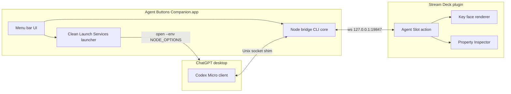
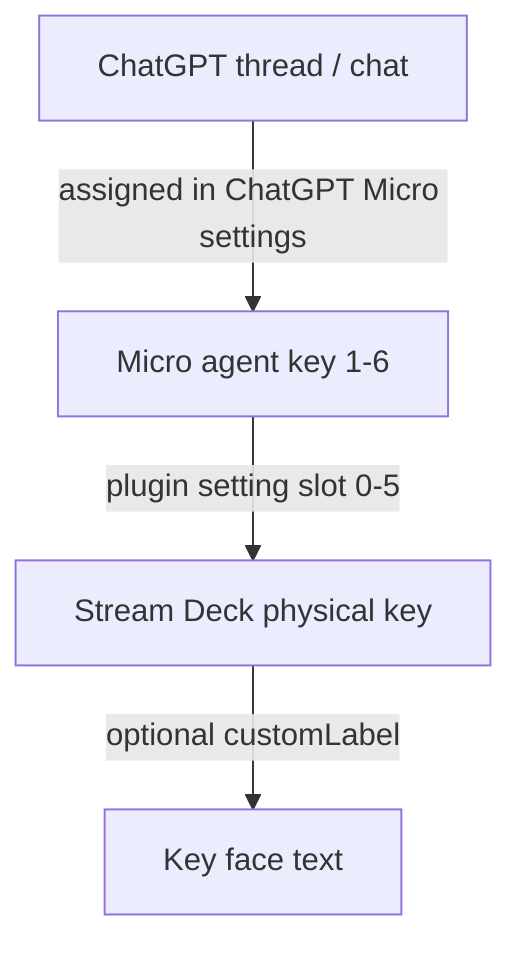

# feat: Marketplace polish completion

## Summary

Turn the working personal MVP into a **submit-ready Stream Deck Marketplace plugin** plus a **notarized macOS companion app**: polished key faces and labels, Property Inspector health/setup (including slot vs thread guidance), optional custom key names, prebuilt profiles, user docs, release packaging, and listing assets — without Windows, command keys, or bundling the companion inside the plugin package.

## Problem Frame

End-to-end status and focus already work (companion shim ↔ ChatGPT Micro protocol ↔ localhost IPC ↔ Agent Slot keys). What remains is product surface: prototype key faces, dual title noise, unused health messages, CLI-only companion, missing profiles/user guide, debug-on release shape, and incomplete Marketplace assets. Original requirements already require Marketplace-shaped packaging, companion as required dependency, multi-model layouts, cold-start docs, and clear offline indication (see origin: `docs/brainstorms/2026-07-22-streamdeck-codex-agent-buttons-requirements.md`). The product outline in `docs/plans/2026-07-23-002-polish-marketplace-readiness-plan.md` is the product-level source this plan implements as execution units.

---

## Requirements

### Deck visual & labels

- R1. Agent keys render a consistent design system: rounded tile, high-contrast fill, slot identity, and a short state word and/or glyph so states are not color-only.
- R2. Slot identity on keys is `A1`–`A6` by default; Micro `AG00` jargon stays out of primary key faces.
- R3. Offline, Off, and Idle remain three distinct faces.
- R4. Keys do not show competing Stream Deck title + baked image text by default (`UserTitleEnabled` off or empty titles; image owns the face).
- R5. Operators may set an optional custom display name per key (e.g. `Ship` instead of `A3`) that replaces or supplements the default slot id on the face.

### Property Inspector & setup

- R6. PI shows live **Companion** and **ChatGPT Micro** connection health (not only a slot picker).
- R7. PI explains **slot vs thread**: Stream Deck slot maps to Micro agent key; thread assignment is in ChatGPT Micro settings.
- R8. PI includes setup links (companion install / user guide) and legal footer (non-affiliation, macOS-only, version).
- R9. Slot selection auto-saves reliably; AG hardware ids are secondary/advanced, not primary labels.

### Companion product

- R10. Companion ships as a **menu bar macOS app** with Start/Stop bridge, Launch ChatGPT with shim (clean Launch Services env), Open logs, Open docs, Quit.
- R11. Optional login-item / open-at-login.
- R12. Companion GitHub release is notarized (or notarization-ready with documented signing steps for the author); install path documented for non-Node users.
- R13. Shim honesty remains: local preload, no ChatGPT file mods, ChatGPT updates may break detection; Input Monitoring is ChatGPT’s grant.

### Layouts, docs, release

- R14. Ship prebuilt Stream Deck profiles (at least XL and one standard layout) with slots 1–6 pre-assigned.
- R15. User setup guide and troubleshooting matrix exist outside the monorepo-dev README.
- R16. Release plugin build: `streamdeck validate` + pack green; `Nodejs.Debug` off; version train toward `1.0.0.0`; quiet production logging.
- R17. Marketplace listing package: real icons, long description, screenshots checklist, support URL, legal line.
- R18. Plugin remains macOS-only; companion remains **outside** the `.streamDeckPlugin` package.

### Carry-forward from origin

- R19. Live status and press-to-focus continue to work for assigned slots (origin R5, R7, AE1–AE2).
- R20. Companion down → offline faces, not stale healthy colors (origin R10, AE3).

---

## Key Technical Decisions

- **KTD1 — Superseding plan 002 as product outline, not dual sources of truth:** Execute this plan’s units; treat `docs/plans/2026-07-23-002-polish-marketplace-readiness-plan.md` as product narrative/reference. Naming, palette, and disclosure rules stay aligned with 002.
- **KTD2 — Image-owned key faces:** Bake slot/custom label + state into SVG (or equivalent) via `setImage`. Default empty Stream Deck titles; set `UserTitleEnabled: false` unless a deliberate advanced mode needs it.
- **KTD3 — Wire existing health IPC, don’t invent a second channel:** Companion already emits `health`; plugin client already has `onHealth` hooks unused by the action. Surface health to PI via `sendToPropertyInspector` (or PI polling getSettings + plugin-held snapshot).
- **KTD4 — Custom label is plugin settings only:** `{ slot, customLabel? }` lives in Stream Deck settings. ChatGPT thread assignment stays in ChatGPT Micro UI (not scraped).
- **KTD5 — Companion menu bar wraps existing Node bridge:** Prefer packaging the current CLI/bridge as a signed app + tray UI over rewriting protocol. Reuse `launch-chatgpt.sh` clean-env `open --env` path.
- **KTD6 — Companion not inside Marketplace zip:** GitHub Releases for companion; plugin PI links to install docs/releases (origin R2 / D5).
- **KTD7 — Phased ship inside one plan:** Units ordered Daily driver → Companion app → Store packaging so visual/PI polish can land before notarization blocks.
- **KTD8 — Release logging:** Demote paint/status spam to debug; keep connection/errors at info/warn.

---

## High-Level Technical Design

### System (unchanged topology, new product shells)

### Operator assignment model

### Delivery phases

| Phase | Units | Outcome |
|-------|-------|---------|
| A Daily driver | U1–U5 | Keys + PI + profiles + user doc feel product-grade |
| B Companion product | U6–U8 | Menu bar app + notarized release path |
| C Store packaging | U9–U11 | Pack, listing, version freeze |

---

## Scope Boundaries

### In scope

- Plugin visual system, PI health/setup/custom labels, profiles, user docs
- Menu bar companion app packaging around existing bridge
- Release engineering for plugin + companion GitHub artifacts
- Marketplace listing content and icon kit

### Deferred to Follow-Up Work

- Windows companion
- Command keys (approve/reject/mic/submit), dials, joystick
- Thread titles from protocol (not available today)
- Bundling companion inside `.streamDeckPlugin`
- Opt-in telemetry
- Home/App Store distribution of companion

### Outside this product's identity

- Official OpenAI / Work Louder / Elgato partnership branding
- Replacing ChatGPT as agent runtime
- Physical Codex Micro hardware support as primary path

---

## Implementation Units

### U1. Key face design system

- **Goal:** Replace flat prototype tiles with a polished face: fill, slot or custom label, short state word and/or glyph; kill dual-title clutter.
- **Requirements:** R1, R2, R3, R4, R5, R19, R20
- **Dependencies:** None
- **Files:**
  - Modify: `plugin/src/render/state-image.ts`
  - Modify: `plugin/src/render/state-image.test.ts`
  - Modify: `plugin/src/actions/agent-slot.ts`
  - Modify: `plugin/com.colemorgan.codex-agent-buttons.sdPlugin/manifest.json`
  - Modify: `plugin/src/actions/agent-slot.test.ts` (if paint settings surface expands)
- **Approach:** Extend renderer inputs to `{ state, slot, customLabel? }`. Default label `A{n}`; if `customLabel` non-empty, use it (truncate for 144px). Map states to short words (`Busy`, `Done`, `Wait`, `Err`, `Off`, `Idle`, `—`). Optional simple SVG glyph. Stop calling `setTitle` with state spam; set empty title. Set `UserTitleEnabled: false`. Keep offline/off/idle visually distinct.
- **Patterns to follow:** Existing `stateImageDataUrl` + color table; pure-function tests decoding data-URLs.
- **Test scenarios:**
  - Happy: idle slot 0 → image contains `A1` and idle styling
  - Happy: customLabel `Ship` → face shows `Ship` not `A1`
  - Edge: long customLabel truncated/ellipsized without breaking SVG
  - Edge: offline vs off vs idle produce different fills and labels
  - Error: unknown state falls back safely
- **Verification:** Unit tests green; on device, six states readable at arm’s length without title double-print.

---

### U2. Settings model: custom label + migration

- **Goal:** Persist optional display name per Agent Slot instance without breaking existing `slot`-only settings.
- **Requirements:** R5, R9
- **Dependencies:** U1 (renderer contract)
- **Files:**
  - Modify: `plugin/src/actions/agent-slot.ts`
  - Modify: `plugin/src/actions/agent-slot.test.ts`
  - Modify: `plugin/com.colemorgan.codex-agent-buttons.sdPlugin/ui/agent-slot.html`
- **Approach:** Settings shape `{ slot: number; customLabel?: string }`. `normalizeSlot` unchanged; add `normalizeCustomLabel` (trim, max length, empty → undefined). On willAppear, rewrite settings with normalized numeric slot; preserve customLabel. PI: text field + auto-save with slot.
- **Patterns to follow:** Existing `normalizeSlot` / `applySlotSettings` pure helpers.
- **Test scenarios:**
  - Happy: missing customLabel → default A-label
  - Happy: whitespace-only customLabel → treated as unset
  - Edge: legacy settings `{ slot: "2" }` still maps to slot 2
  - Edge: customLabel length cap enforced
- **Verification:** Changing label in PI updates face without losing slot; old profiles still load.

---

### U3. Wire health to PI + setup copy

- **Goal:** PI shows companion/ChatGPT health and teaches slot vs thread + setup.
- **Requirements:** R6, R7, R8, R9, R13, R20
- **Dependencies:** None (parallel with U1/U2 after shared action file merge care)
- **Files:**
  - Modify: `plugin/src/ipc-client.ts` (if health callback typing needs export)
  - Modify: `plugin/src/actions/agent-slot.ts`
  - Modify: `plugin/com.colemorgan.codex-agent-buttons.sdPlugin/ui/agent-slot.html`
  - Modify: `plugin/src/ipc-client.test.ts`
  - Modify: `plugin/src/actions/agent-slot.test.ts` as needed
- **Approach:** On `health` messages and connection changes, broadcast to open PIs (`sendToPropertyInspector` with `{ companion, chatgpt, message? }`). PI panel: connection rows, slot select (Slot 1–6 only), custom label field, setup checklist/links (GitHub releases + user guide path/URL), legal footer. Auto-save slot/label on change. Document thread reassignment: ChatGPT Micro agent keys, not PI.
- **Patterns to follow:** Existing PI `sendToPropertyInspector` handler stub; companion `health` payload in `packages/protocol/src/ipc.ts`.
- **Test scenarios:**
  - Happy: health `chatgpt: connected` surfaces in payload sent to PI (unit via mock/spy if available; otherwise client parses health)
  - Happy: IPC disconnect → instances offline (existing) and health payload reflects companion down
  - Integration: hello + health frames still accepted by client
- **Verification:** With companion up/down and ChatGPT connected/waiting, PI text matches reality without reading logs.

---

### U4. Quiet production logging + release-oriented plugin defaults

- **Goal:** Plugin is store-safe: less log spam, debug flag off for release builds, version/docs alignment noted.
- **Requirements:** R16
- **Dependencies:** Soft — can land after U1–U3
- **Files:**
  - Modify: `plugin/src/actions/agent-slot.ts`
  - Modify: `plugin/com.colemorgan.codex-agent-buttons.sdPlugin/manifest.json`
  - Modify: `plugin/package.json` / root scripts if adding validate/pack helpers
  - Optionally: `plugin/rollup.config.mjs` for release define
- **Approach:** Paint/status at debug; keep connection/errors at info/warn. Document dual config or script that packs with `Nodejs.Debug` disabled. Align README Node/Software min claims with engines/manifest in a small docs touch (or U10).
- **Test expectation:** none — logging/config only; smoke that tests still pass.
- **Verification:** After soak, logs are not multi-MB from paint alone; pack manifest has debug off.

---

### U5. Profiles + user setup guide

- **Goal:** Importable layouts and a non-dev cold-start guide including thread reassignment.
- **Requirements:** R7, R14, R15
- **Dependencies:** U1–U3 preferred so screenshots/docs match UI
- **Files:**
  - Create: `profiles/` (or `docs/profiles/`) XL + standard layout exports / documented layout JSON as Stream Deck allows
  - Create: `docs/user/setup.md`
  - Create: `docs/user/troubleshooting.md`
  - Modify: `README.md` (link to user docs; keep dev README shorter)
- **Approach:** Setup guide: install plugin → install companion → launch ChatGPT via companion → confirm Micro Connected → assign chats in ChatGPT → import profile / add slots → verify busy color. Troubleshooting table from companion README + IM / ELECTRON_RUN_AS_NODE lessons. Explicit “reassign thread in ChatGPT; reassign slot in PI.”
- **Test expectation:** none — docs/profiles; manual import smoke on author’s XL.
- **Verification:** Author cold-start under ~10 minutes from guide alone; thread reassignment is unambiguous.

---

### U6. Companion menu bar application shell

- **Goal:** Non-Node users can run the bridge from a menu bar app.
- **Requirements:** R10, R11, R13
- **Dependencies:** Existing companion CLI/bridge stable
- **Files:**
  - Create: companion packaging tree (e.g. `companion/app/` or `companion/macos/`) — exact stack chosen at implement time (SwiftUI menu bar, or Electron/Tauri tray wrapping `node` binary, or Platypus-style — prefer smallest maintainable signed approach)
  - Modify: `companion/src/cli.ts` if needed for machine-readable status / single-instance
  - Modify: `companion/scripts/launch-chatgpt.sh` (invoked from menu)
  - Modify: `companion/README.md`
- **Approach:** Menu: status (IPC + chatgpt health), Start/Stop, Launch ChatGPT with shim, Open logs, Open docs, Open at Login, Quit. Embed or locate built Node bridge. Single-instance lock on port/socket. Never set `ELECTRON_RUN_AS_NODE` into ChatGPT env.
- **Patterns to follow:** Clean launch script; health from bridge; logs under `~/Library/Logs/`.
- **Test scenarios:**
  - Companion unit: existing CLI/bridge tests still pass
  - Manual: menu Start → plugin keys leave offline; Launch ChatGPT → health connected; Quit → offline
- **Verification:** Daily use without terminal for bridge + ChatGPT launch.

---

### U7. Companion install artifact + notarization path

- **Goal:** GitHub Release installable companion with signing/notarization documented and executed for author releases.
- **Requirements:** R12, R18
- **Dependencies:** U6
- **Files:**
  - Create: packaging scripts under `companion/scripts/` (build-app, notarize notes)
  - Create: GitHub release checklist (may live in `docs/user/companion-install.md`)
  - Modify: PI links (U3) to release URL once known
- **Approach:** Produce `.app` or `.dmg`. Document Developer ID + notarization. Version companion semver aligned with plugin train. Do not embed inside `.sdPlugin`.
- **Test expectation:** none automated for notarization; checklist verification.
- **Verification:** Fresh Mac can install companion from release without `npm install`.

---

### U8. Companion About / disclosure surfaces

- **Goal:** Legal and shim honesty on companion UI, not only README.
- **Requirements:** R8, R13
- **Dependencies:** U6
- **Files:** Companion app About/menu strings; `companion/README.md`
- **Approach:** Non-affiliation; macOS-only; what the shim does; Input Monitoring is ChatGPT; link to user guide.
- **Test expectation:** none — copy.
- **Verification:** About/menu readable without opening GitHub.

---

### U9. Icon kit + static key assets

- **Goal:** Replace placeholder marketplace/category/action icons with a coherent kit; refresh default key image if needed.
- **Requirements:** R17
- **Dependencies:** U1 design language
- **Files:**
  - Modify: `plugin/com.colemorgan.codex-agent-buttons.sdPlugin/imgs/**`
  - Companion `.icns` if U6 app needs it
- **Approach:** High-contrast developer-tool aesthetic; no OpenAI/Micro trademark cloning. Provide 1× and 2× where required by Elgato.
- **Test expectation:** none — assets; `streamdeck validate` catches missing paths.
- **Verification:** Validate passes; icons look intentional in Marketplace mock and category list.

---

### U10. Pack, version freeze, listing package

- **Goal:** `1.0.0.0` (or agreed train) packable plugin + Marketplace listing draft.
- **Requirements:** R16, R17, R18
- **Dependencies:** U1–U5, U9; companion release URL from U7 preferred
- **Files:**
  - Modify: `plugin/com.colemorgan.codex-agent-buttons.sdPlugin/manifest.json` (version, debug off, description)
  - Modify: `package.json` / workspace versions as needed
  - Create: `docs/marketplace/listing.md` (title, description, screenshots checklist, support URL)
  - Create: issue template optional under `.github/` for support fields
  - Modify: root `README.md` badges/links
- **Approach:** Add npm scripts for validate/pack if CLI available. Listing draft from plan 002 §10. Screenshots checklist references real UI from U1–U3/U6.
- **Test scenarios:** monorepo `npm test` green; build all packages; validate plugin.
- **Verification:** Packed `.streamDeckPlugin` installs cleanly; listing doc ready to paste into Elgato portal.

---

### U11. Soak & acceptance pass

- **Goal:** Prove polish acceptance criteria on author hardware.
- **Requirements:** R19, R20 + all acceptance examples below
- **Dependencies:** U1–U10 as available; minimum U1–U5 + U6 for full story
- **Files:**
  - Create: `docs/user/acceptance-checklist.md` (or section in setup)
- **Approach:** Manual matrix: cold start, six states, focus, offline, custom labels, IM granted under companion launch, profile import.
- **Test expectation:** manual checklist signed off by author.
- **Verification:** Checklist complete without terminal except optional log peek.

---

## Acceptance Examples

- AE1. **Busy color** — Given companion + ChatGPT Micro connected and slot 1 assigned, when that agent works, then the key shows Busy/working styling within ~1s (origin AE1).
- AE2. **Focus** — Pressing slot 2 focuses that Micro agent in ChatGPT (origin AE2).
- AE3. **Offline** — Quitting companion paints offline faces, not idle white (origin AE3).
- AE4. **Custom label** — Setting display name `Ship` on a key shows `Ship` on the face after save.
- AE5. **PI health** — Companion running + ChatGPT connected shows both Connected in PI; stopping companion flips companion row.
- AE6. **Thread reassign** — User guide alone is enough to reassign a thread in ChatGPT without changing PI slot.
- AE7. **Clean launch IM** — ChatGPT launched from companion menu keeps Input Monitoring granted the same as Dock (no `ELECTRON_RUN_AS_NODE`).
- AE8. **Pack** — `streamdeck validate` (and pack) succeed with debug off.

---

## Risk Analysis & Mitigation

| Risk | Mitigation |
|------|------------|
| ChatGPT update breaks shim | Document; version pin notes; companion can still demo; isolate preload |
| Menu bar packaging stack choice delays B | U1–U5 ship first; U6 stack decision at implement with smallest notarizable path |
| Elgato review pushback on “injection” | Honest PI/listing copy; open source; companion separate; no ChatGPT file mods |
| Notarization Apple account friction | Document manual steps; ship unsigned only for personal until ready — listing can say companion required from GitHub |
| Profile format differs by SD Software version | Prefer documented manual layout if export fragile |
| Health not delivered when no PI open | OK; keys still paint from status |

---

## Documentation Plan

| Artifact | Owner unit |
|----------|------------|
| `docs/user/setup.md` | U5 |
| `docs/user/troubleshooting.md` | U5 |
| `docs/user/companion-install.md` | U7 |
| `docs/marketplace/listing.md` | U10 |
| Companion About strings | U8 |
| Root README links | U5 / U10 |

---

## Dependencies / Prerequisites

- Stream Deck Software + CLI (`streamdeck`) for validate/pack
- Apple Developer ID for notarized companion (author)
- Working MVP path (already true on author Mac)
- ChatGPT desktop with Micro settings accessible

---

## Open Questions (implementation-time, non-blocking)

- Exact menu bar stack (native Swift vs lightweight wrapper) — choose in U6 by packaging cost.
- Public GitHub release URL final name — fill when repo is public/release-ready.
- Whether Elgato category taxonomy forces rename of Category string — adjust at listing time.

---

## System-Wide Impact

- Plugin settings schema gains `customLabel` (backward compatible).
- Log volume drops (supportability).
- Companion becomes a second distributable with its own versioning and signing lifecycle.
- Support burden shifts from “clone repo” to “install two artifacts”; issue template should capture both versions.

---

## Sources & Research

- Origin requirements: `docs/brainstorms/2026-07-22-streamdeck-codex-agent-buttons-requirements.md`
- Product polish outline: `docs/plans/2026-07-23-002-polish-marketplace-readiness-plan.md`
- MVP architecture: `docs/plans/2026-07-22-001-feat-streamdeck-codex-agent-buttons-plan.md`
- Repo patterns: health already on wire (`packages/protocol/src/ipc.ts`, `plugin/src/ipc-client.ts`); paint in `plugin/src/render/state-image.ts`; clean ChatGPT launch in `companion/scripts/launch-chatgpt.sh`
- No `docs/solutions/` learnings yet — capture IM/shim/PI lessons after ship via compound

---

## Success Metrics

- Author daily-drives without opening companion README
- Cold start ≤10 minutes from user guide
- Marketplace submission packet complete (plugin pack + companion release + listing + screenshots checklist)
- AE1–AE8 pass on author XL
